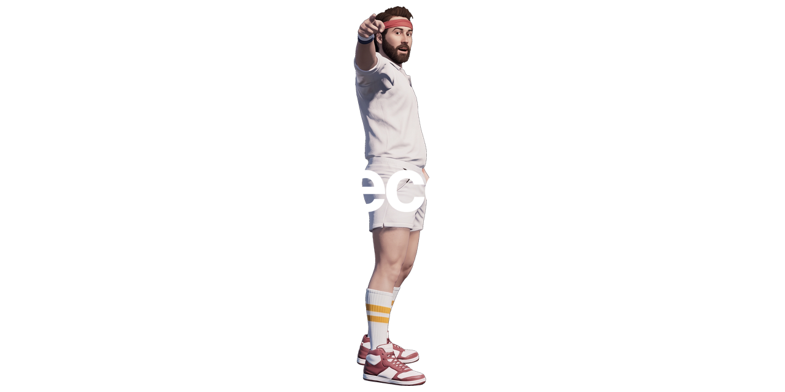

An unofficial native recompilation of the Xbox 360 version of Skate 3, supporting Windows and Linux, built with a Skate-specific [rexglue SDK](https://github.com/rexglue/rexglue-sdk) fork.

The game is currently capable of running at ~165FPS at 4K with MSAA, using an RTX 4090.

The project does not include Skate 3 retail game files. To run or build the project, you must provide files from your own legally obtained Xbox 360 copy of Skate 3.

## How Do I Play?

### Windows

1. Download the latest release Skate3Recomp-Windows.zip from the releases page.
2. Extract it anywhere you like, to a folder you control.
3. Run skate3.exe.
4. Click "Select ISO" to select your legally obtained copy of Skate 3.
5. Wait for the installer to extract the game files.
6. Click "Start Game".

### Linux

1. Download the latest release Skate3Recomp-Linux.zip from the releases page.
2. Extract it anywhere you like, to a folder you control.
3. Run skate3.
4. Click "Select ISO" to select your legally obtained copy of Skate 3.
5. Wait for the installer to extract the game files.
6. Click "Start Game".

## Controls

- Standard Xbox controls using an Xbox controller are the preferred and main input method. DualShock and others are untested, but are likely to work with Steam Input through XInput.
- Keyboard controls can be enabled in the game settings menu.
- Press Escape on keyboard or (Back + Start) on the controller to open the game settings menu.

### Keyboard Keybinds

- Left stick: W/A/S/D
- Right stick: mouse movement
- A/B/X/Y: Space/C/E/F
- LT/RT: RMB/LMB
- LB/RB: Q/R
- Left stick press: Shift
- Right stick press: MMB
- Back/Start: Tab/Return

## Building from Source

Clone with submodules:

```sh
git clone --recursive <repo-url> skate3recomp
cd skate3recomp
```

If you already cloned without submodules:

```sh
git submodule sync --recursive
git submodule update --init --recursive --jobs "$(nproc 2>/dev/null || echo 4)"
```

The build-time codegen needs an extracted game dump containing `default.xex` and
`data/webkit/EAWebkit.xex`. Put that dump in `game/`, or pass a path with
`SKATE3_GAME_DATA_ROOT`.

Generate the recompiled source first:

```sh
cmake --preset relwithdebinfo -DSKATE3_GAME_DATA_ROOT="$PWD/game"
cmake --build --preset relwithdebinfo --target generate-all --parallel
```

Then reconfigure so CMake sees the generated source lists and build:

```sh
cmake --preset relwithdebinfo -DSKATE3_GAME_DATA_ROOT="$PWD/game"
cmake --build --preset relwithdebinfo --parallel
```

For release packaging, use the `release` preset on Windows or the
`linux-release` preset on Linux.

## Ubuntu/Linux Build

These instructions target Ubuntu 24.04 LTS on x86_64. Other distributions need
the same toolchain shape: CMake, Ninja, Clang 20 or newer, Vulkan development
headers, GTK 3 development headers, and SDL-compatible audio/input development
packages.

ReXGlue requires Clang. Clang 20 is recommended on Ubuntu because it matches the
Linux toolchain used by the rexglue SDK CI and avoids Ubuntu 24.04's
Clang 18/libstdc++ `std::expected` feature-test mismatch.

Install LLVM's apt repository and dependencies:

```sh
sudo apt update
sudo apt install -y wget gnupg lsb-release software-properties-common
wget https://apt.llvm.org/llvm.sh
chmod +x llvm.sh
sudo ./llvm.sh 20
sudo apt install -y \
  git cmake ninja-build build-essential pkg-config p7zip-full \
  clang-20 lld-20 \
  libgtk-3-dev libx11-xcb-dev \
  libvulkan-dev vulkan-tools mesa-vulkan-drivers \
  libasound2-dev libpulse-dev libpipewire-0.3-dev libudev-dev
```

Optional packages improve controller/input and diagnostics coverage in SDL:

```sh
sudo apt install -y libusb-1.0-0-dev libunwind-dev libibus-1.0-dev liburing-dev
```

Initialize submodules and verify the local environment:

```sh
./scripts/bootstrap-linux.sh
```

Configure, generate, reconfigure, and build a development build:

```sh
cmake --preset linux-relwithdebinfo -DSKATE3_GAME_DATA_ROOT="$PWD/game"
cmake --build --preset linux-relwithdebinfo --target generate-all --parallel
cmake --preset linux-relwithdebinfo -DSKATE3_GAME_DATA_ROOT="$PWD/game"
cmake --build --preset linux-relwithdebinfo --parallel
```

Build a Linux release:

```sh
cmake --preset linux-release -DSKATE3_GAME_DATA_ROOT="$PWD/game"
cmake --build --preset linux-release --target generate-all --parallel
cmake --preset linux-release -DSKATE3_GAME_DATA_ROOT="$PWD/game"
cmake --build --preset linux-release --parallel
```

The release artifacts are:

```text
out/build/linux-release/skate3
out/build/linux-release/librexruntime.so
```

## Running a Development Build

On Linux:

```sh
./scripts/run-linux.sh
```

The launcher sets `LD_LIBRARY_PATH` for development builds, passes
`--game_data_root="$PWD/game"`, and selects SDL controller input on Linux. To
use a game dump outside the repository:

```sh
SKATE3_GAME_DATA_ROOT="/path/to/extracted/game" ./scripts/run-linux.sh
```

Keyboard-to-controller emulation is off by default. Pass `--mnk_mode` or set
`SKATE3_MNK=1` to enable it:

```sh
SKATE3_MNK=1 ./scripts/run-linux.sh
```

Fullscreen is on by default. Pass `--no-fullscreen` to start windowed.

To run the Linux development executable directly:

```sh
LD_LIBRARY_PATH="$PWD/third_party/rexglue-sdk/out/linux-amd64${LD_LIBRARY_PATH:+:$LD_LIBRARY_PATH}" \
  ./out/build/linux-relwithdebinfo/skate3 --game_data_root="$PWD/game" --input_backend=sdl
```

## rexglue Fork

`third_party/rexglue-sdk` is pinned as a Git submodule to the
`skate3-sdk-clean` branch of the Skate-specific rexglue fork. Clone
recursively or run:

```sh
git submodule sync --recursive
git submodule update --init --recursive --jobs "$(nproc 2>/dev/null || echo 4)"
```

The fork is based on rexglue's 0.8.0 release line and contains the Skate 3
runtime, codegen, input, graphics, timing, and Linux fixes needed by this
project.

## Credits

- [rexglue SDK](https://github.com/rexglue/rexglue-sdk), the recompilation SDK
  used by this project.
- [Xenia](https://github.com/xenia-project/xenia), whose Xbox 360 research and
  tooling have helped the broader recompilation ecosystem.
